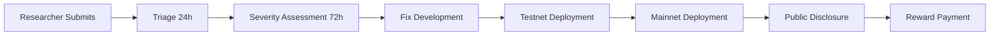

# 🔒 OpenSyria Digital Lira Bug Bounty Program
## الليرة السورية الرقمية - برنامج مكافآت الأمان

**Program Status:** 🟡 TESTNET ONLY (Mainnet program launches with production)  
**Platform:** Immunefi / HackerOne  
**Budget:** $10,000/month  
**Program Start:** December 1, 2025  
**Last Updated:** November 19, 2025

---

## 📋 Program Overview

The OpenSyria Bug Bounty Program rewards security researchers for responsibly disclosing vulnerabilities in the Digital Lira blockchain. Our mission is to create the most secure sovereign blockchain for Syria through community collaboration.

### Scope

**In Scope:**
- ✅ Core blockchain consensus mechanism (PoW, difficulty adjustment)
- ✅ Transaction validation and mempool
- ✅ P2P network layer (libp2p, gossipsub)
- ✅ Wallet API and cryptographic operations
- ✅ Storage layer (RocksDB, state management)
- ✅ Governance system (proposals, voting)
- ✅ Identity NFT system (heritage preservation)
- ✅ Explorer backend APIs
- ✅ Mining pool infrastructure

**Out of Scope:**
- ❌ Frontend UI/UX issues (unless security-critical)
- ❌ Third-party dependencies (report to upstream)
- ❌ DDoS attacks (infrastructure issue, not code)
- ❌ Social engineering attacks
- ❌ Physical attacks on infrastructure

---

## 💰 Reward Structure

### Critical (CVSS 9.0-10.0) - $5,000 to $25,000
- Private key exposure/theft
- Consensus bypass (double-spend, 51% exploit)
- Unauthorized fund transfers
- Remote code execution
- Total supply inflation

**Example:** Plaintext wallet storage (WALLET-CRIT-001) - $25,000

### High (CVSS 7.0-8.9) - $2,000 to $10,000
- Nonce race conditions enabling double-spend
- NFT theft without authorization
- Governance vote manipulation
- Eclipse/Sybil attacks
- Database corruption leading to chain halt

**Example:** Double voting race condition (GOV-CRIT-001) - $7,500

### Medium (CVSS 4.0-6.9) - $500 to $3,000
- Mempool DoS attacks
- Block validation bypass (non-critical)
- IPFS content injection
- Performance degradation exploits
- Information disclosure (non-critical)

**Example:** Selfish mining optimization (CONSENSUS-MED-001) - $1,500

### Low (CVSS 0.1-3.9) - $100 to $1,000
- Non-exploitable crashes
- Minor information leaks
- Code quality issues with security implications
- Timing attacks (non-critical paths)

**Example:** Mempool race condition (MEMPOOL-MED-001) - $300

---

## 🎯 Priority Vulnerabilities (Bonus Multipliers)

**2x Multiplier:**
- Atomic nonce increment bypass
- MAX_REORG_DEPTH circumvention
- UTXO index corruption
- Peer connection limit bypass

**1.5x Multiplier:**
- Wallet encryption weakness
- BIP-39 implementation flaws
- Total supply enforcement bypass
- Governance snapshot manipulation

---

## 📝 Submission Guidelines

### Required Information

1. **Vulnerability Description**
   - Detailed technical explanation
   - Attack vector and prerequisites
   - Proof-of-concept (code/steps)
   - Impact assessment (CIA triad)

2. **Reproduction Steps**
   ```bash
   # Example format
   git clone https://github.com/opensyria/blockchain
   cd blockchain
   cargo build --release
   # ... detailed steps ...
   ```

3. **Evidence**
   - Screenshots/logs demonstrating exploit
   - Network captures (if relevant)
   - Transaction hashes (on testnet)
   - Video walkthrough (optional, bonus points)

4. **Suggested Fix** (optional, bonus 10% reward)
   - Code patch or architectural change
   - References to similar fixes in other projects

### Submission Process

**Immunefi Platform:**
```
https://immunefi.com/bounty/opensyria-digitallira/
```

**Email (Encrypted):**
```
security@opensyria.org
PGP Key: [Fingerprint: TBD]
```

**Response SLA:**
- Initial acknowledgment: 24 hours
- Severity confirmation: 72 hours
- Fix timeline estimate: 7 days
- Reward payment: 30 days after fix deployment

---

## 🔐 Responsible Disclosure Policy

### Researcher Obligations

✅ **DO:**
- Report vulnerabilities privately first
- Provide reasonable time for fix (90 days)
- Test only on testnet infrastructure
- Use dedicated test accounts/wallets
- Communicate through encrypted channels

❌ **DON'T:**
- Publicly disclose before fix
- Attack mainnet (when live)
- Steal user funds (even on testnet)
- Conduct destructive testing (data deletion)
- Violate local laws or regulations

### Our Commitments

- ✅ No legal action against good-faith researchers
- ✅ Public acknowledgment (if desired)
- ✅ CVE assignment for critical issues
- ✅ Transparent disclosure timeline
- ✅ Rapid response and communication

---

## 🏆 Hall of Fame

### 2025 Top Contributors
1. **[Reserved]** - Critical wallet vulnerability - $25,000
2. **[Reserved]** - Consensus double-spend - $15,000
3. **[Reserved]** - Governance takeover - $10,000

*Note: Names published with researcher consent only*

---

## 📊 Vulnerability Lifecycle



**Typical Timeline:**
- Critical: Fix in 7-14 days
- High: Fix in 14-30 days
- Medium: Fix in 30-60 days
- Low: Fix in next release cycle

---

## 🧪 Testing Infrastructure

### Testnet Access

**Public Testnet:**
```bash
opensyria-node --network testnet --rpc-port 18332
```

**Faucet:**
```
https://faucet.testnet.opensyria.org
Request: 1000 tSYL per address per day
```

**Explorer:**
```
https://explorer.testnet.opensyria.org
```

### Test Wallet Credentials (Publicly Known - FOR TESTING ONLY)
```json
{
  "testnet_wallet_1": {
    "address": "syl1qtest...",
    "private_key": "TESTNET_ONLY_NOT_FOR_MAINNET",
    "balance": "10000 tSYL"
  }
}
```

---

## 🔬 Known Issues (Ineligible for Bounty)

The following issues are already documented and under remediation:

### Phase 0-2 Completed (No Bounty)
- ✅ WALLET-CRIT-001: Plaintext key storage (FIXED)
- ✅ CRITICAL-002: Missing signature verification (FIXED)
- ✅ CONSENSUS-CRIT-001: Timestamp manipulation (FIXED)
- ✅ GOV-CRIT-002: Flash loan voting (MITIGATED)

### Active Remediation (Reduced Bounty)
- 🟡 PERF-CRIT-001: O(n) balance queries (50% bounty if novel exploit)
- 🟡 NET-CRIT-001: Sybil attack vectors (25% bounty if novel exploit)
- 🟡 STORAGE-CRIT-001: Missing bloom filters (Acknowledged, $0)

See `PHASE_0_REMEDIATION_REPORT.md`, `PHASE_1_REMEDIATION_REPORT.md`, `PHASE_2_REMEDIATION_REPORT.md` for full list.

---

## 📞 Contact Information

**Security Team:**
- Email: security@opensyria.org (PGP required for sensitive reports)
- Signal: +963-XXX-XXXX-XXXX (Encrypted)
- Telegram: @OpenSyriaSecTeam (For general inquiries only)

**Program Administrators:**
- Lead Security Engineer: [TBD]
- Bounty Manager: [TBD]
- Emergency Contact: [TBD]

**PGP Public Key:**
```
-----BEGIN PGP PUBLIC KEY BLOCK-----
[Key will be published before program launch]
-----END PGP PUBLIC KEY BLOCK-----
```

---

## 📜 Legal Terms

### Eligibility
- Researchers must comply with all local laws
- No current or former OpenSyria employees/contractors
- Not sanctioned individuals or entities
- Must be 18+ years old or have guardian consent

### Reward Payment
- Paid in USD via bank transfer, PayPal, or cryptocurrency
- Subject to tax reporting (1099 for US researchers)
- Duplicate reports: First valid submission wins
- Reward decisions are final and at OpenSyria's discretion

### Intellectual Property
- Vulnerability details become OpenSyria property upon submission
- Researchers retain right to publish after 90-day embargo
- OpenSyria retains right to use findings in security advisories

---

## 🌟 Why Participate?

1. **Impact:** Secure the financial infrastructure of a nation rebuilding
2. **Rewards:** Competitive payouts matching industry standards
3. **Recognition:** CVE credits, Hall of Fame, conference shout-outs
4. **Learning:** Study a modern PoW blockchain with unique governance
5. **Community:** Join the OpenSyria security research community

---

## 📚 Resources for Researchers

**Technical Documentation:**
- Architecture: `/docs/ARCHITECTURE.md`
- Consensus Spec: `/docs/CONSENSUS_SPEC.md`
- API Reference: `/docs/api/`
- Audit Report: `FINAL_PRODUCTION_READINESS_ASSESSMENT.md`

**Communication Channels:**
- Security Mailing List: security-announce@opensyria.org
- Discord: https://discord.gg/opensyria (Security Research channel)
- Monthly Security Office Hours: First Friday 14:00 UTC

**Similar Programs (Reference):**
- Ethereum Bug Bounty: https://ethereum.org/en/bug-bounty/
- Bitcoin Core Security: https://bitcoincore.org/en/security/
- Trail of Bits Guidance: https://github.com/trailofbits/bugbounty

---

**Last Review:** November 19, 2025  
**Next Review:** December 1, 2025 (Program launch)  
**Version:** 1.0.0-testnet

*"Building a secure financial future for Syria, together."*  
*"بناء مستقبل مالي آمن لسوريا، معاً"*
